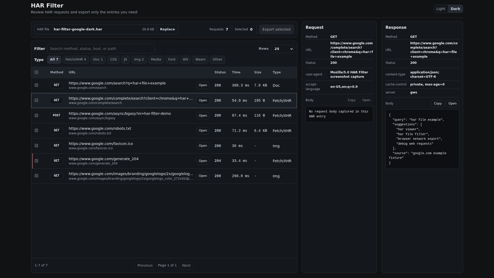
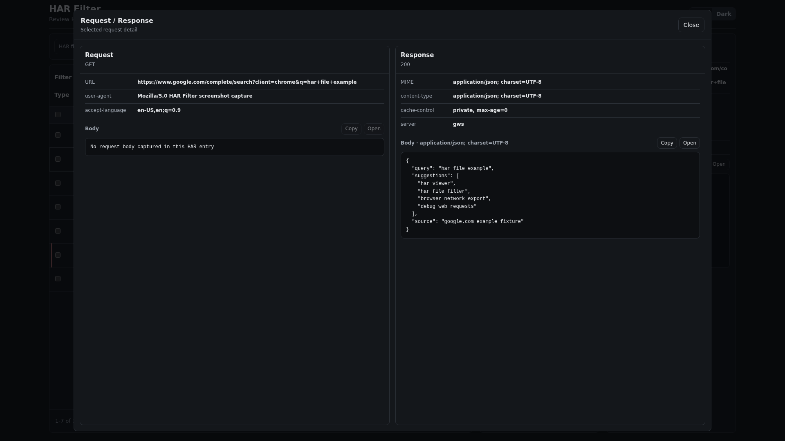
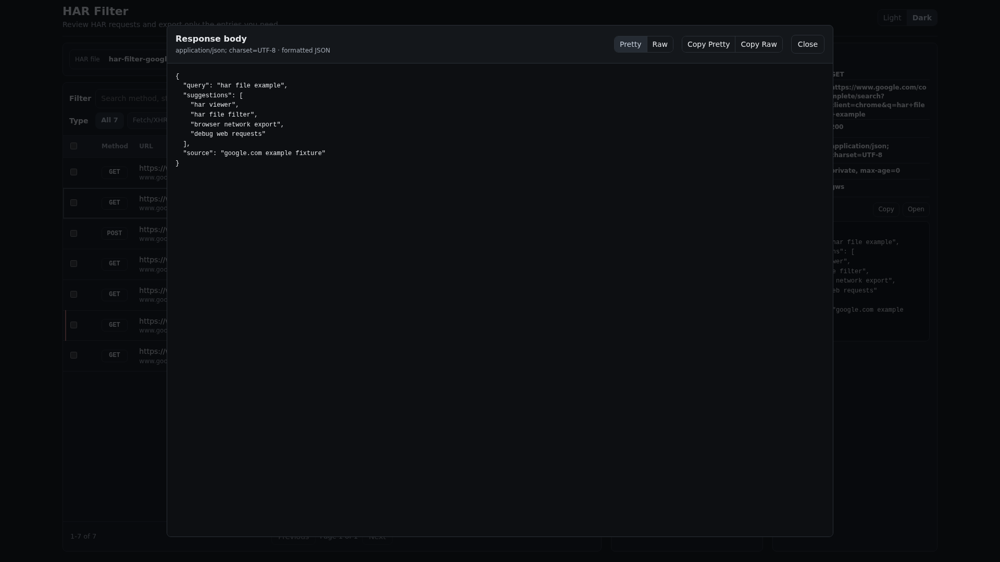

# HAR Filter

[](https://github.com/Hamachi-Multi/har-filter/releases/latest)
[](https://github.com/Hamachi-Multi/har-filter/releases)
[](https://github.com/Hamachi-Multi/har-filter/actions/workflows/ci.yml)
[](https://github.com/Hamachi-Multi/har-filter/blob/main/LICENSE)

HAR Filter is a local web UI for opening large HAR captures, reviewing the request list, and exporting a smaller HAR file with only the entries you select

It is designed for support, debugging, and handoff workflows where a full browser capture is too large or contains unrelated traffic

## Screenshots

| Main Page |
| --- |
|  |

| Detail Modal | Body Viewer Modal |
| --- | --- |
|  |  |

<!--
Add more screenshots under public/assets/screenshots/, which is exported to assets/screenshots/ in the public repository

<details>
  <summary>More screenshots</summary>

  <br />

  

</details>
-->

## Highlights

- Runs locally on `127.0.0.1:17680` by default
- Uploads a HAR file and keeps the session in server memory
- Filters by request type, method, status, host, path, or URL text
- Selects individual requests or all visible filtered requests
- Shows request and response details before export
- Exports a valid HAR containing only the selected entries
- Ships as self-contained Linux, macOS, and Windows release assets

## Quick Start

Download the latest release for your operating system from [GitHub Releases](https://github.com/Hamachi-Multi/har-filter/releases/latest)

Linux x64 example:

```bash
tar -xzf har-filter-<version>-linux-amd64.tar.gz
cd har-filter-<version>-linux-amd64
./harserver -addr 127.0.0.1:17680
```

macOS uses the `darwin` archive for your chip type, and Windows uses the `.zip` asset and runs `harserver.exe`

Then open:

```text
http://127.0.0.1:17680
```

## Release Assets

Each release publishes:

| Platform | Asset |
| --- | --- |
| Linux x64 | `har-filter-<version>-linux-amd64.tar.gz` |
| Linux arm64 | `har-filter-<version>-linux-arm64.tar.gz` |
| macOS Intel | `har-filter-<version>-darwin-amd64.tar.gz` |
| macOS Apple Silicon | `har-filter-<version>-darwin-arm64.tar.gz` |
| Windows x64 | `har-filter-<version>-windows-amd64.zip` |
| Checksums | `SHA256SUMS` |

Verify downloaded assets with:

```bash
sha256sum -c SHA256SUMS
```

## Install With Go

If Go is installed:

```bash
go install github.com/Hamachi-Multi/har-filter/cmd/harserver@latest
harserver -addr 127.0.0.1:17680
```

## Usage

1. Open the local web UI
2. Select or drop a `.har` file
3. Use the type filters and search box to narrow the request list
4. Select the requests you want to keep
5. Review request and response details when needed
6. Click **Export selected** to download a filtered HAR

## Runtime Options

```bash
harserver -addr 127.0.0.1:17680
harserver -addr 127.0.0.1:17680 -max-upload-mb 512
```

| Flag | Default | Description |
| --- | --- | --- |
| `-addr` | `127.0.0.1:17680` | HTTP listen address |
| `-max-upload-mb` | `200` | Maximum HAR upload size in MiB |

Uploaded HAR files are kept in memory for 30 minutes

## Security Notes

HAR files often contain sensitive URLs, headers, cookies, tokens, and payloads

- Keep the server bound to loopback unless you trust the network
- Binding outside loopback, such as `0.0.0.0:17680`, prints a warning
- Browser API requests are accepted only from the same origin
- HAR-derived responses are sent with no-store cache headers
- Uploaded files are retained in memory only for the active session window

## API

HAR Filter is primarily a browser app, but the local server exposes two JSON endpoints:

| Endpoint | Description |
| --- | --- |
| `POST /api/upload` | Upload a HAR file in multipart field `har`; optional `replaceId` deletes a previous session after the new upload succeeds |
| `POST /api/export` | Send `{ "id": "...", "indexes": [0, 3, 7] }` to download a HAR containing only those entries |

## Development

This public repository contains the runtime source and release automation

```bash
go test ./...
go build ./cmd/harserver
go run ./cmd/harserver -addr 127.0.0.1:17680
```

## License

[MIT](LICENSE)
